## Laporan Praktikum

|  | Pemrograman Berbasis Framework 2025 |
|--|--|
| NIM |  2241720217|
| Nama |  Muhammad Bagus Indrawan |
| Kelas | TI - 3A |

## Langkah-langkah Praktikum 
### 1. Persiapan Lingkungan 
1. Pastikan Node.js dan npm sudah terinstal di komputer Anda. Anda dapat memeriksanya dengan 
menjalankan perintah berikut di terminal atau command prompt: 
node -v 
npm -v 

2. Buat direktori baru untuk proyek Next.js Anda: 
mkdir website-pribadi 
cd website-pribadi 

3. Inisialisasi proyek Next.js dengan TypeScript dan App Router: 
npx create-next-app@latest . --typescript –app 

4. Cek konfigurasi postcss.config.mjs: 

5. Cek di app/globals.css, sudah ada import untuk tailwindcss: 

6. Buka app/layout.tsx, tambahkan import './globals.css', dan modifikasi menjadi sebagai berikut: 

7. Jalankan aplikasi Next.js: 
npm run dev 
Aplikasi akan terbuka di browser pada alamat http://localhost:3000.

## 2. Membuat Halaman Website 

1. Buat file app/page.tsx sebagai halaman "Tentang Saya": 

2. Buat file app/projects/page.tsx sebagai halaman "Proyek": 

3. Buat file app/essays/page.tsx sebagai halaman "Esai": 

4. Buka browser dan akses: 
- http://localhost:3000/ untuk halaman "Tentang Saya". 

- http://localhost:3000/projects untuk halaman "Proyek". 

- http://localhost:3000/essays untuk halaman "Esai".

## 3. Membuat Layout dan Navigasi

1. Buat direktori src/components jika belum ada. 
2. Buat file src/components/Layout.tsx 
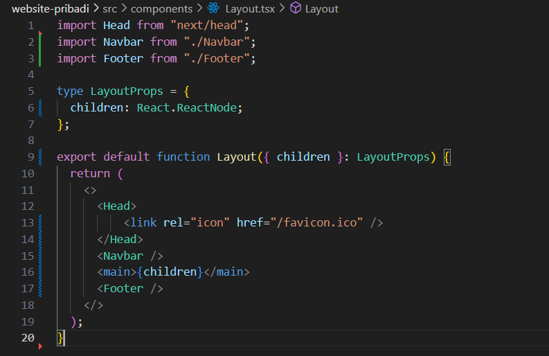
3. Buat file src/components/Navbar.tsx
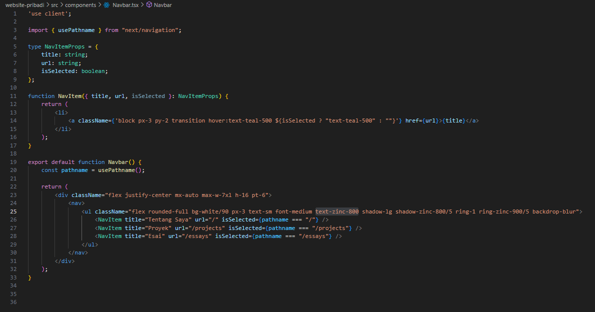
4. Buat file src/components/Footer.tsx
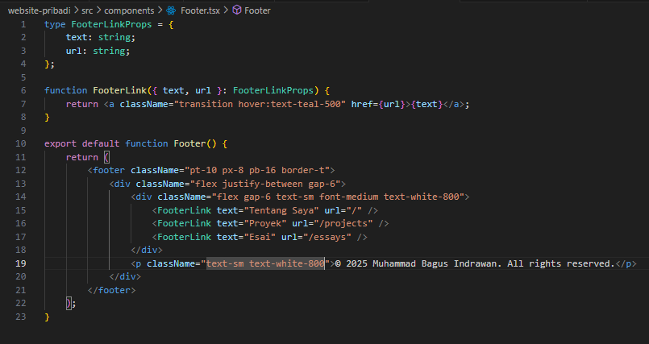
5. Update file app/layout.tsx untuk menggunakan layout
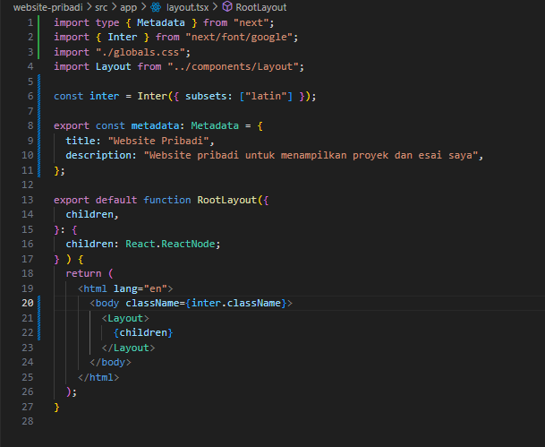
6. Update setiap halaman menambahkan metadata dengan generateMetadata
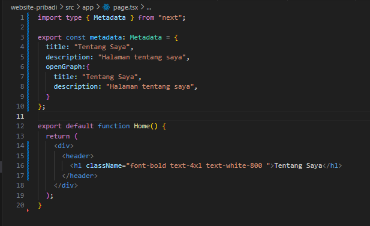
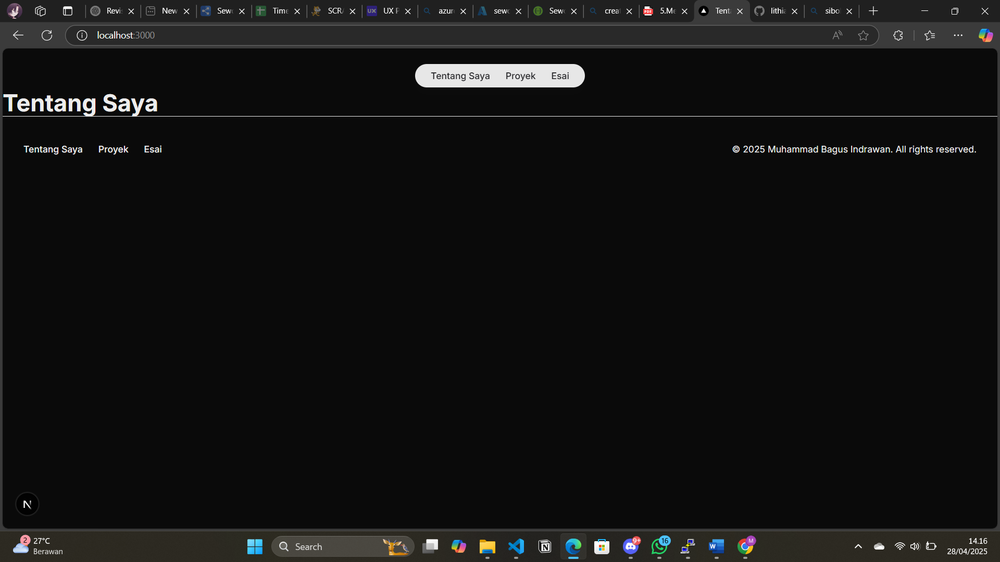
Lakukan hal yang sama untuk halaman projects/page.tsx dan essays/page.tsx. 
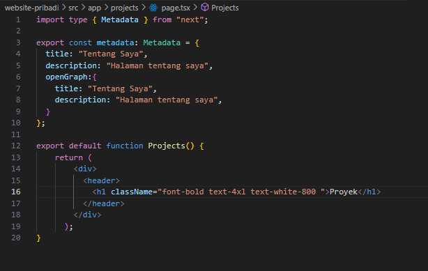
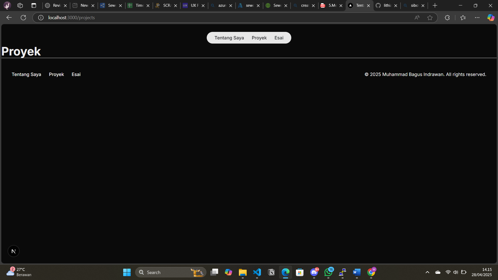

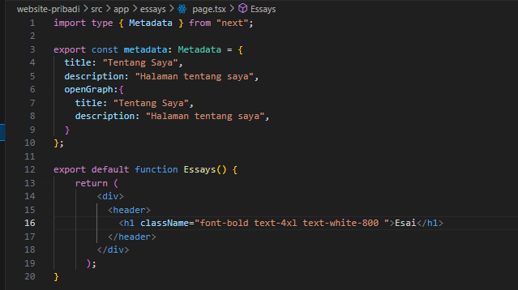
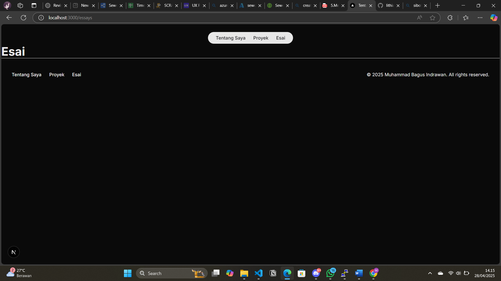

## 4. Membuat Halaman Proyek dengan Grid Responsif 

1. Buat folder di public/images. Kemudian tambahkan dua image, lalu rename dengan nama 
project1.png dan project2.png 
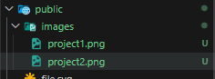

2. Modifikasi file app/projects/page.tsx: 
Tambahkan import next/image dan beberapa image yang telah ditambahkan sebelumnya 
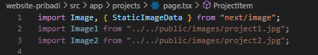
Buat card project item sebagai berikut: 
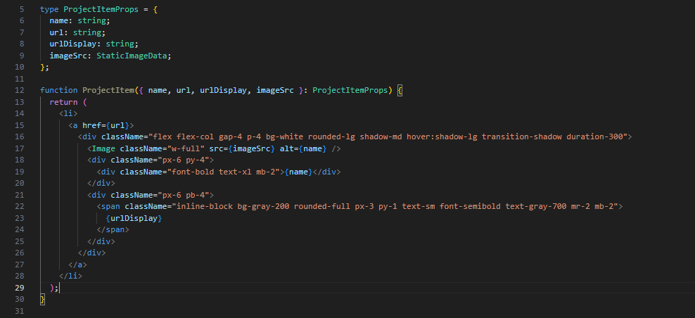

Modifikasi komponen project sebagai berikut: 
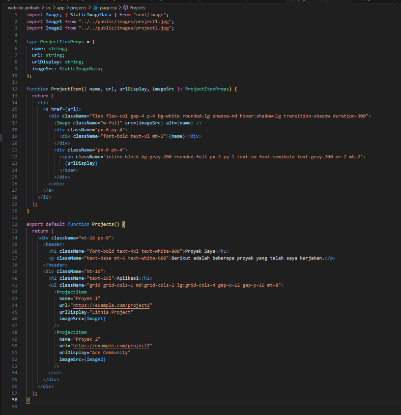

3. Simpan file dan buka http://localhost:3000/projects di browser. Anda akan melihat daftar proyek 
dalam grid yang responsif.
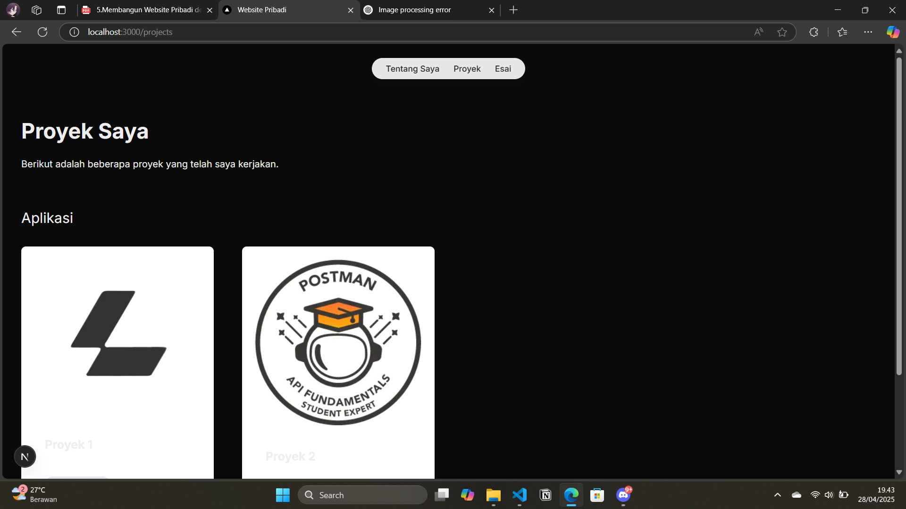